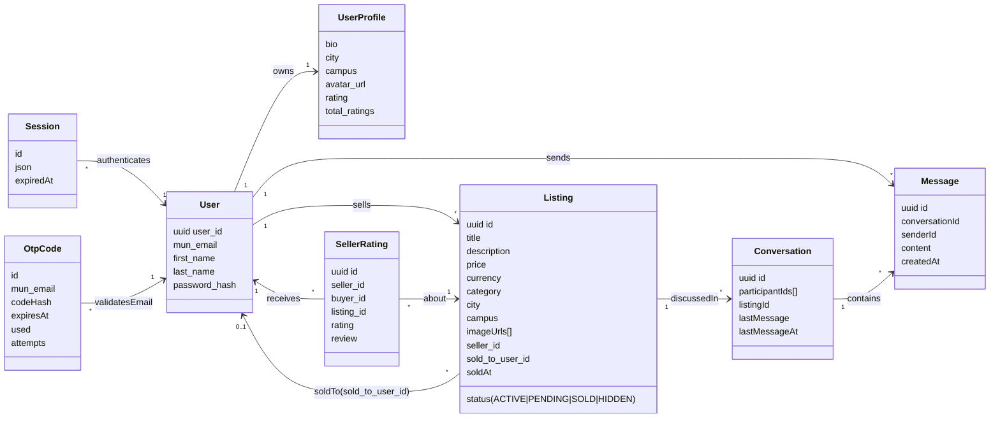
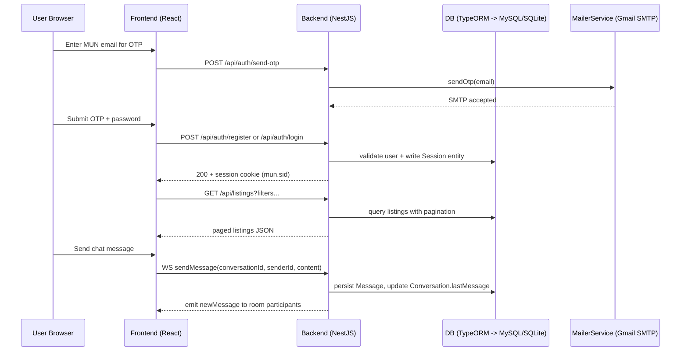
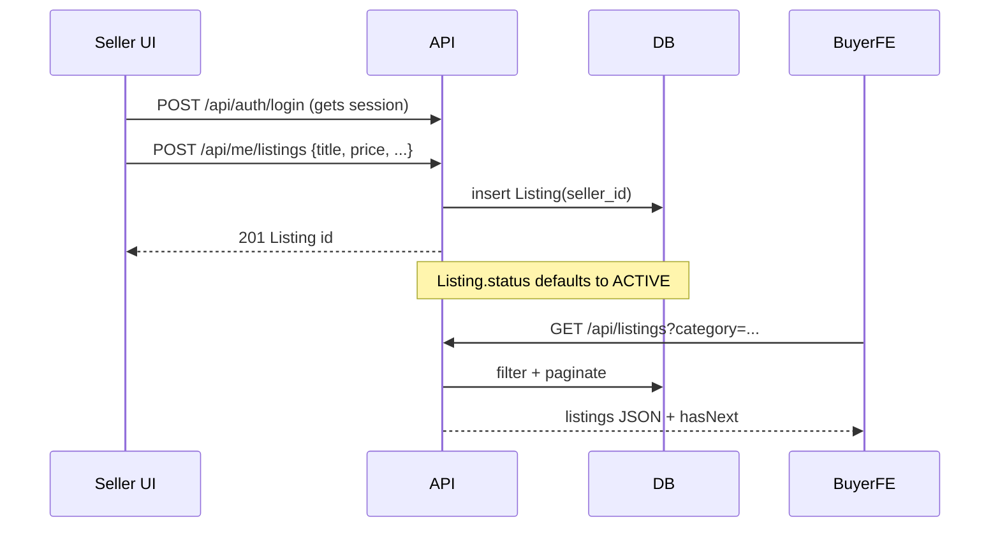

# MUN Marketplace — 4+1 View Diagrams

This captures the current architecture from the codebase (React frontend, NestJS backend, MySQL, Socket.IO chat, email OTP auth). URLs assume the global `/api` prefix set in `backend/src/main.ts`.

## Logical View (Domain Model)


## Development View (Code & Module Structure)
```mermaid
flowchart TD
  subgraph FE[Frontend (Vite React + Axios)]
    Pages --> Components --> Services --> APIClient[services/api.js Axios instance]
    APIClient --> LocalState[localStorage sessionUser]
  end

  subgraph BE[Backend (NestJS + TypeORM)]
    App[AppModule] --> Auth[AuthModule\nsessions + OTP + mailer]
    App --> Users[UsersModule\nusers + profiles]
    App --> Listings[ListingModule\nlisting.controller.ts\nuser-listing.controller.ts]
    App --> Chat[ChatModule\nChatGateway (Socket.IO)]
    App --> Ratings[SellerRatingsModule\naggregates profile ratings]
    App --> TestSupport[(TestSupportModule\nnon-prod only)]
    Auth --> Users
    Listings --> Users
    Chat --> Ratings
    Ratings --> Users
    App --> TypeORM[(TypeORM datasource)]
  end

  FE -->|HTTP /api...| BE
  FE -->|WebSocket /socket.io| Chat
  TypeORM --> DB[(MySQL in dev/prod; SQLite in tests)]
```

## Process View (Runtime Interaction & Concurrency)


## Physical View (Deployment & Environment)
```mermaid
flowchart LR
  subgraph Client
    Browser[Browser\nReact SPA runtime]
  end

  subgraph AppTier
    Frontend[Static assets\nVite dev :5173 or CDN]
    Backend[NestJS API + Socket.IO\n:3000]
  end

  subgraph DataTier
    MySQL[(MySQL 8\nDocker service 3306)]
    phpMyAdmin[phpMyAdmin UI\nDocker :8081]
  end

  Browser -->|HTTPS| Frontend
  Frontend -->|REST /api + cookies| Backend
  Frontend -->|WS /socket.io| Backend
  Backend -->|TypeORM| MySQL
  phpMyAdmin <-->|SQL| MySQL
  Backend -->|SMTP| Gmail[marketplacemun@gmail.com]
```

## Scenario View (Key Use Cases)
### A. Seller posts listing, buyer browses


### B. Buyer chats and rates seller after purchase
```mermaid
sequenceDiagram
  participant Buyer as Buyer UI
  participant BE as API/WS
  participant DB as DB
  Buyer->>BE: POST /api/chat/conversations {userId1=buyer,userId2=seller,listingId}
  BE->>DB: find/create Conversation
  Buyer->>BE: WS sendMessage(conversationId,...)
  BE->>DB: save Message, update Conversation.lastMessage
  BE-->>Buyer: WS newMessage broadcast
  Seller marks sold: PATCH /api/me/listings/:id/sold {buyerId}
  BE->>DB: update Listing.status=SOLD, sold_to_user_id=buyer
  Buyer->>BE: POST /api/users/:sellerId/ratings {listingId,rating,review}
  BE->>DB: upsert SellerRating + refresh profile aggregates
  BE-->>Buyer: rating receipt
```
